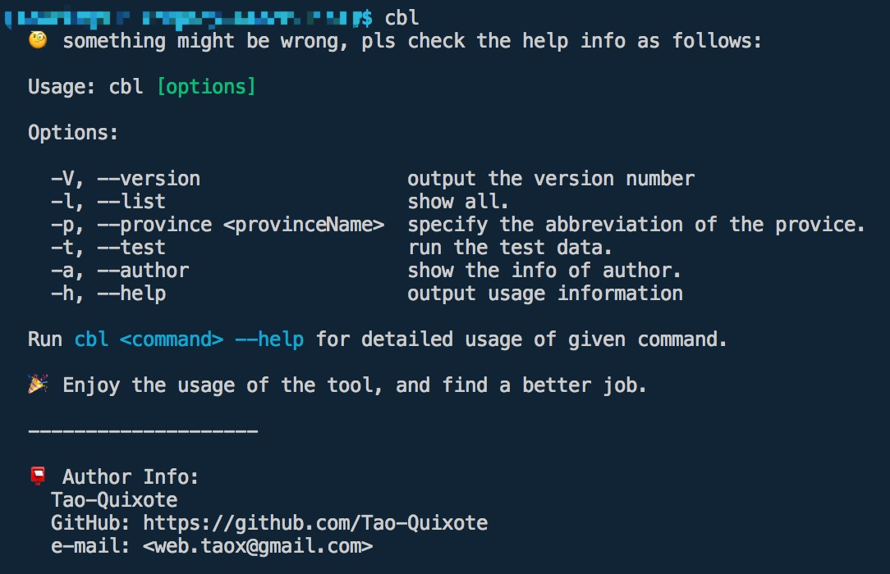
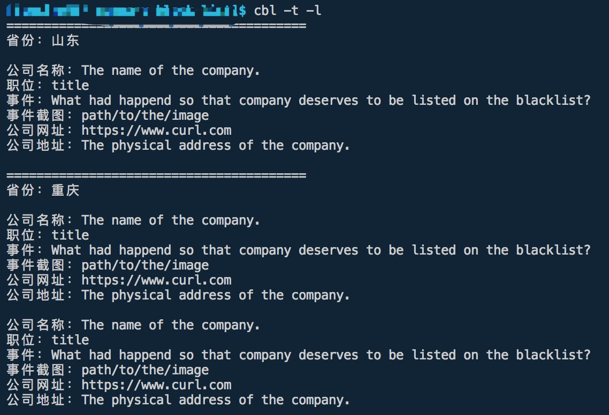
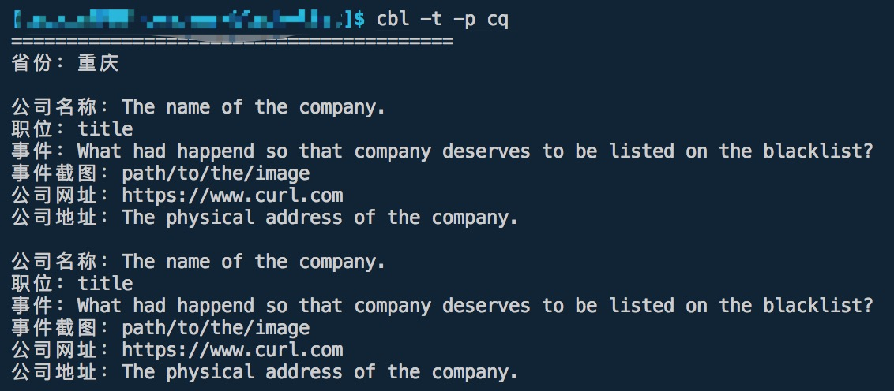

# README

**企业求职黑名单**

> <small style="color: red;">现在还没有正式的数据，请先使用测试数据。🍖</small>

## install

```shell
npm install company-blacklist -g
```

## command options

### 命令 - cbl



### -V, --version

输出当前版本信息。

### -t, --test

使用测试数据。测试数据所在位置：

```
|-src
  |- data
    |- test.json
```

### -l, --list

输出所有公司信息：



### -p, --province

输出指定省份(地区)的公司信息，参数值为指定省份(地区)的首字母缩写：



## JSON 数据格式

正式的数据保存在 `src/data.json` 文件中，json 数据格式参照：

```json
{
  "sd": { // 省份(地区)名称的首字母缩写
    "zh": "山东", // 省份(地区)中文名称
    "companies": [ // 保存该省份(地区)公司信息的数组
      {
        "cname": "The name of the company.", // 公司名称
        "title": "title", // 职位
        "curl": "https://www.curl.com", // 公司网址
        "caddr": "The physical address of the company.", // 公司地址
        "affair": "What had happend so that company deserves to be listed on the blacklist?", // 导致该公司上榜的事件
        "path": "path/to/the/image" // 事件截图
      }
    ]
  },
  "cq": {
    "zh": "重庆",
    "companies": [
      {
        "cname": "The name of the company.",
        "title": "title",
        "curl": "https://www.curl.com",
        "caddr": "The physical address of the company.",
        "affair": "What had happend so that company deserves to be listed on the blacklist?",
        "path": "path/to/the/image"
      },
      {
        "cname": "The name of the company.",
        "title": "title",
        "curl": "https://www.curl.com",
        "caddr": "The physical address of the company.",
        "affair": "What had happend so that company deserves to be listed on the blacklist?",
        "path": "path/to/the/image"
      }
    ]
  }
}
```

-- 上面的数据为测试数据。

## PR 信息

**<span style="color: red;">该工具的目的是为了大家避开求职中遇到的不好的企业，找到更好、更适合自己的公司，所以在上传数据的时候，请大家理性、客观的上传数据，不要因为私心而故意抹黑一家企业，感谢 🙏。</span>**

该仓库本着公平、公正、公开的原则，由广大的程序猿朋友们贡献“黑心企业”的名单，为广大的程序猿朋友们提供求职指北，避开雷区。

为了保证不是员工因个人原因被开除之后故意黑公司，请在提交 PR 的时候上传凭证截图。

PR 中的信息包括但不限于：

* 公司名称
* 职位
* 公司网址
* 公司地址
* 具体事件
* 截图
* ...etc

## 目录

```
|- img
|- src
  |- data
  |- images // 截图凭证
  |- lib
  |- data.json
  |- index.js
```